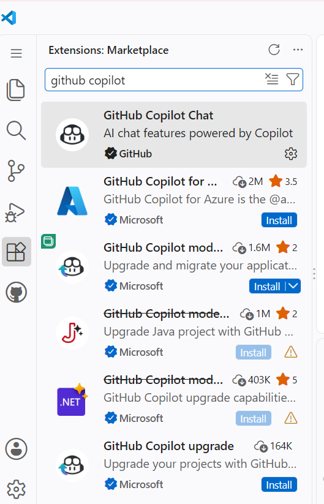
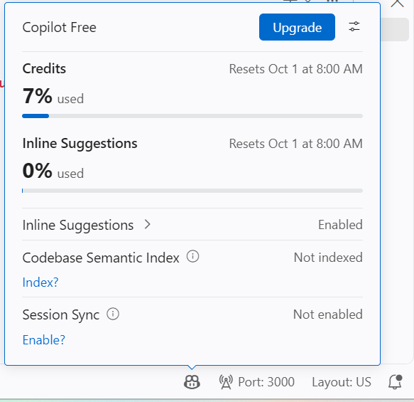
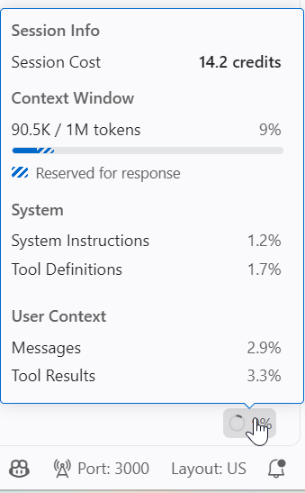

## 目的
這份是用來記錄嘗試過程遇到的想法

### 問題或者認爲有微調的可能性記錄

標題是哪個檔案
每一個問題或者可以微調機會用 list number 呈現

#### docs/facilitator.md
1. [ ]【問題】- [每人發**紅 / 綠兩張紙卡**:卡住就把紅卡立起來,助教掃過全場就知道去哪](https://github.com/alantsai2007/copilot-workshop-agent-mode-mcp/blob/bffdce050a1662f48907d81afd4012d020c719ed/docs/facilitator.md?plain=1#L49)
    1. 綠卡用來做什麽？
    2. 會需要桌長制度嗎？

#### docs/00-setup.md
[三、安裝 VS Code 擴充套件](https://github.com/alantsai-samples/copilot-workshop-agent-mode-mcp/blob/bffdce050a1662f48907d81afd4012d020c719ed/docs/00-setup.md?plain=1#L46)
1. [ ]【問題】需不需要加上網頁查詢的鏈接：
    1. GitHub Copilot: https://marketplace.visualstudio.com/items?itemName=GitHub.copilot
    2. GitHub Copilot Chat: https://marketplace.visualstudio.com/items?itemName=GitHub.copilot-chat
    3. Live Preview: https://marketplace.visualstudio.com/items?itemName=ms-vscode.live-server
2. [ ] 不過目前在 VS Code Extension 是查不到 GitHub Copilot （我記得好像某個版本之後是内建整合到 VS Code）
    

#### AGENDA.md
1. [ ] [| 13:15 – 13:25 | **Agent Mode 是什麼** — 和 Ask / Edit 的差別,為什麼它改變了寫程式的方式 |](https://github.com/alantsai-samples/copilot-workshop-agent-mode-mcp/blob/bffdce050a1662f48907d81afd4012d020c719ed/AGENDA.md?plain=1#L51) => Edit 模式還選的到嗎？預設應該剩下 Agent/Ask/Plan

#### .github/steps/1-step.md
1. [ ] [- [ ] **重新整理頁面(F5),資料還在** ← 這代表 localStorage 有正確運作](https://github.com/alantsai-samples/copilot-workshop-agent-mode-mcp/blob/bffdce050a1662f48907d81afd4012d020c719ed/.github/steps/1-step.md?plain=1#L169) => 這個要不要往上，放在 `- [ ] 按刪除按鈕,項目消失` 的上面，不然因爲已經刪除了，所以重新刷新的時候清單還是空的，看不到資料還在這件事

2. [ ] [- [ ] 清空所有項目後,出現「還沒有任何待辦事項」的提示](https://github.com/alantsai-samples/copilot-workshop-agent-mode-mcp/blob/bffdce050a1662f48907d81afd4012d020c719ed/.github/steps/1-step.md?plain=1#L170) => 準確的文字是 `還沒有任何待辦事項,新增一個吧!` 是否要調整？

#### .github/steps/5-step.md
1. [ ] [### ⌨️ 動手做 C:用 AI 產生你的作品集頁](https://github.com/alantsai-samples/copilot-workshop-agent-mode-mcp/blob/bffdce050a1662f48907d81afd4012d020c719ed/.github/steps/5-step.md?plain=1#L81)
  1. prompt 看要不要調整成爲會讓 agent 請他輸入【網址】在產生頁面 -> 避免需要手動改

#### 其他
1.[ ] 是否有需要加入一些參考資料讓他們帶回去自己學習，譬如説
    1. 官方 tutorial：https://docs.github.com/en/copilot/tutorials
    2. awesome copilot, community 清單: https://awesome-copilot.github.com/

### 備注
執行完的狀況

